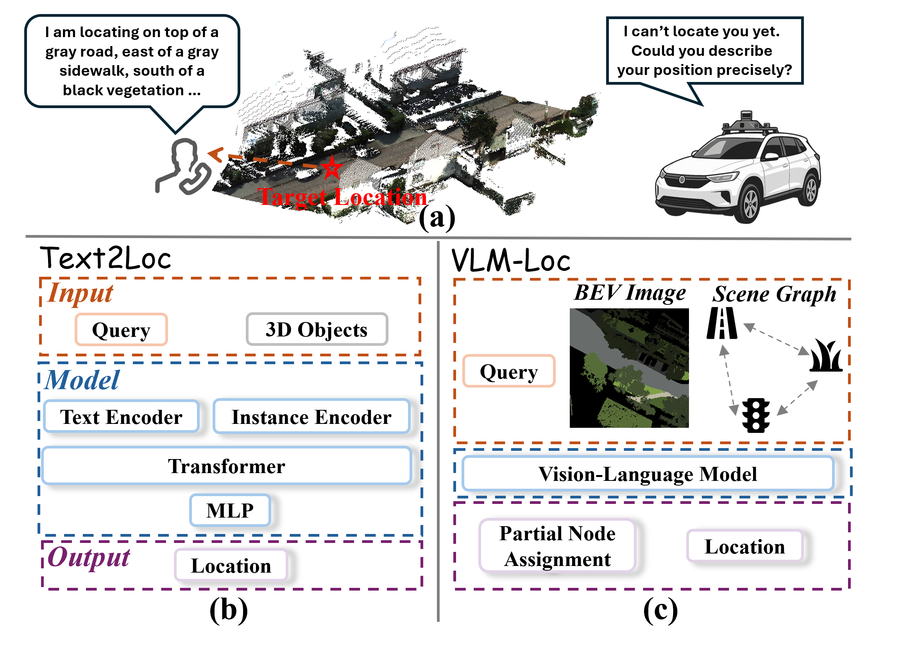

<h2>
VLM-Loc: Localization in Point Cloud Maps via Vision-Language Models
</h2>

Official implementation of the following publication:

> **VLM-Loc: Localization in Point Cloud Maps via Vision-Language Models**<br/>
> [Shuhao Kang](https://kang-1-2-3.github.io/), [Youqi Liao](https://martin-liao.github.io/), [Peijie Wang](https://scholar.google.com/citations?user=jUitttEAAAAJ&hl=zh-CN), [Wenlong Liao](https://scholar.google.com/citations?hl=en&user=7DqW7gIAAAAJ), [Qilin Zhang](https://www.linkedin.com/in/qilin-zhang-807480261/), [Benjamin Busam](https://www.professoren.tum.de/en/busam-benjamin), [Xieyuanli Chen†](https://chen-xieyuanli.github.io/), [Yun Liu†](https://yun-liu.github.io/)<br/>
> *CVPR 2026*<br/>
> **Paper** | [**Arxiv**](https://arxiv.org/abs/2603.09826)

## 🔭 Introduction

<p align="center">
  <strong>TL;DR: VLM-Loc is a VLM-based framework for localization in point cloud maps.</strong>
</p>

<p align="center">
  
</p>
<p align="justify">
<strong>Abstract:</strong>
Text-to-point-cloud (T2P) localization aims to infer precise spatial positions within 3D point cloud maps from natural language descriptions, reflecting how humans perceive and communicate spatial layouts through language. However, existing methods largely rely on shallow text-point cloud correspondence without effective spatial reasoning, limiting their accuracy in complex environments. To address this limitation, we propose VLM-Loc, a framework that leverages the spatial reasoning capability of large vision-language models (VLMs) for T2P localization. Specifically, we transform point clouds into bird’s-eye-view (BEV) images and scene graphs that jointly encode geometric and semantic context, providing structured inputs for the VLM to learn cross-modal representations bridging linguistic and spatial semantics. On top of these representations, we introduce a partial node assignment mechanism that explicitly associates textual cues with scene graph nodes, enabling interpretable spatial reasoning for accurate localization. To facilitate systematic evaluation across diverse scenes, we present CityLoc, a benchmark built from multi-source point clouds for fine-grained T2P localization. Experiments on CityLoc demonstrate VLM-Loc achieves superior accuracy and robustness compared to state-of-the-art methods.
</p>

## 💻 Installation

This project is built on top of [ms-swift](https://github.com/modelscope/ms-swift).

Please install the environment required by [ms-swift](https://github.com/modelscope/ms-swift), or use its Docker image.

## 🚅 Usage

### 1. Prepare the *CityLoc* datasets and checkpoints

#### 1.1 Download preprocessed data and checkpoints (Option 1)

<p align="center">
  &nbsp;&nbsp;🤗 <a href="https://huggingface.co/datasets/kang233/VLM-Loc">Hugging Face</a>&nbsp;&nbsp; | &nbsp;&nbsp;🤖 <a href="https://modelscope.cn/datasets/kang2233/VLM-Loc">ModelScope</a>&nbsp;&nbsp;
</p>

```text
CityLoc-C.tar.gz       --> CityLoc-C dataset
CityLoc-K.tar.gz       --> CityLoc-K dataset
dataset_items.tar.gz   --> Dataset items for training, validation, and testing in ms-swift format
checkpoints.tar.gz     --> Adapter weights for multiple base models
```

**Notes**
1. Adapter weights are provided for Qwen3-VL-2B, 4B, 8B, 32B, and InternVL3.5-8B. Please download the corresponding base model before training or inference.
2. You may need to update the image paths in the dataset items to match your local environment.

Extract the files into this directory. Example:

```bash
tar -xzvf /home/data_sata/vlmloc/vlm-loc/dataset_items.tar.gz
```

#### 1.2 Generate the datasets from KITTI360 and CityRefer (Option 2)

__KITTI360__

1. Download KITTI-360 from the [official website](https://www.cvlibs.net/datasets/kitti-360/), including:
   - `data_poses` (vehicle poses)
   - `data_3d_semantics` (Accumulated Point Clouds for Train & Val, and Test Semantic)

   Organize the files as follows:

```text
KITTI-360
----data_3d_semantics
------2013_05_28_drive_0000_sync
------...
------2013_05_28_drive_0010_sync
----data_poses
------2013_05_28_drive_0000_sync
------...
------2013_05_28_drive_0010_sync
```

2. Configure `datapreparation/args.py`, then run:

```bash
python datapreparation/kitti360pose/prepare_cityloc-k.py
```

3. Generate dataset items:

```bash
python data/dataset_generation_semantics_cityloc-k.py
```

__CityRefer__

1. Download the code and data, then organize them following [CityRefer](https://github.com/ATR-DBI/CityRefer).
2. Replace `data/sensaturban/split_data.py` in CityRefer with [split_data.py](split_data.py).
3. Run `split_data.py`.
4. Configure `datapreparation/args.py`, then run:

```bash
python datapreparation/kitti360pose/prepare_cityloc-c.py
```

5. Generate dataset items:

```bash
python data/dataset_generation_semantics_cityloc-c.py
```

### 2. Inference and evaluation

Run inference with:

```bash
bash test.sh
```

Evaluate the results with:

```bash
python recall.py
```

### 3. Training

Run training with:

```bash
bash train.sh
```

CityLoc-K is used for training and validation, while the remaining data is used for testing.

Training can be performed on 2 × RTX 4090 GPUs with Qwen3-VL-8B. The batch size can be increased if more GPUs are available.

<!-- ## 💡 Citation

If this repository is helpful, please consider giving it a star. If this project benefits your work, please consider citing VLM-Loc.

```bibtex
@article{kang2025opal,
  title={Opal: Visibility-aware lidar-to-openstreetmap place recognition via adaptive radial fusion},
  author={Kang, Shuhao and Liao, Martin Y and Xia, Yan and Wysocki, Olaf and Jutzi, Boris and Cremers, Daniel},
  journal={arXiv preprint arXiv:2504.19258},
  year={2025}
}
``` -->

## 🙏 Acknowledgements

We thank [Text2Pos](https://github.com/mako443/Text2Pos-CVPR2022) and [CityRefer](https://github.com/ATR-DBI/CityRefer) for their code implementations.